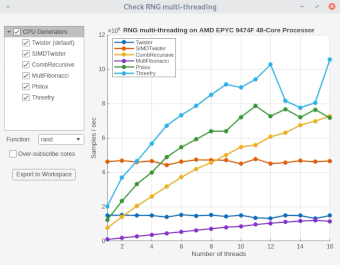

# RNGMultiThreading

Visualize how MATLAB's RNGs multi-thread.

Use this application to view side-by-side comparisons of MATLAB Random 
Number Generator (RNG) performance as the number of available computational
threads is varied. Results can be exported to the MATLAB workspace for 
further analysis.

## Installation 
To install the app from within MATLAB:
* Open the Add-Ons panel by clicking the Add-Ons icon on the left sidebar of the desktop.
* Search for "RNGMultiThreading" in the search box at the top of the Add-Ons panel.
* Select the app from the list and click the **Install** button.

For alternative installation methods, see [Get and Manage Add-Ons](https://www.mathworks.com/help/matlab/matlab_env/get-add-ons.html).

### Required Products
To use this app, you need:
* [MATLAB](https://www.mathworks.com/products/matlab.html) release R2025a or newer.

## Setup
To open the app, go to the **Apps** tab and expand the apps gallery by clicking the down arrow on the far right, then click on the app icon in the **My Apps** section.

## Getting Started 
To start measuring random number generator performance, select a generator 
by ticking the box next to its name. The app then computes the results for 
that generator. You can also select or deselect all generators using the
parent entry **CPU**.

By default, the app measures the performance of generating large arrays of 
random numbers using the [`rand`](https://www.mathworks.com/help/matlab/ref/double.rand.html) function. 
To instead measure the performance of normally-distributed random number 
generators, you can choose to use the [`randn`](https://www.mathworks.com/help/matlab/ref/double.randn.html) function.

The plotted data can be exported to the MATLAB workspace as a table for 
further analysis using the **Export to Workspace** button.

## License
The license is available in the [license.txt](license.txt) file in this GitHub repository.

## Community Support
[MATLAB Central](https://www.mathworks.com/matlabcentral)

Copyright 2025 The MathWorks, Inc.